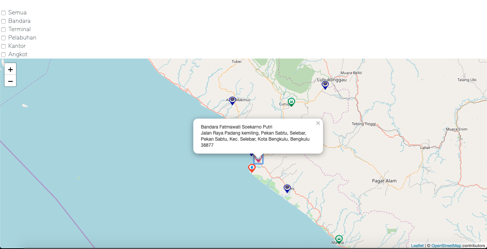

# Contoh Laravel Menggunakan Leaflet JS



1. Clone this repo.
    ```bash
    $ git clone git@github.com:rizkylab/sample-laravel-leaflet.git
    # or
    $ git clone git@github.com:rizkylab/sample-laravel-leaflet.git
    ```
2. `$ cd sample-laravel-leaflet`
3. `$ composer install`
4. `$ cp .env.example .env`
5. `$ php artisan key:generate`
6. Set **database config** on `.env` file
7. `$ php artisan migrate`
8. `$ php artisan serve`
10. Open `https://localhost:8000` with browser.


## License

This project is open-sourced software licensed under the [MIT license](LICENSE).
